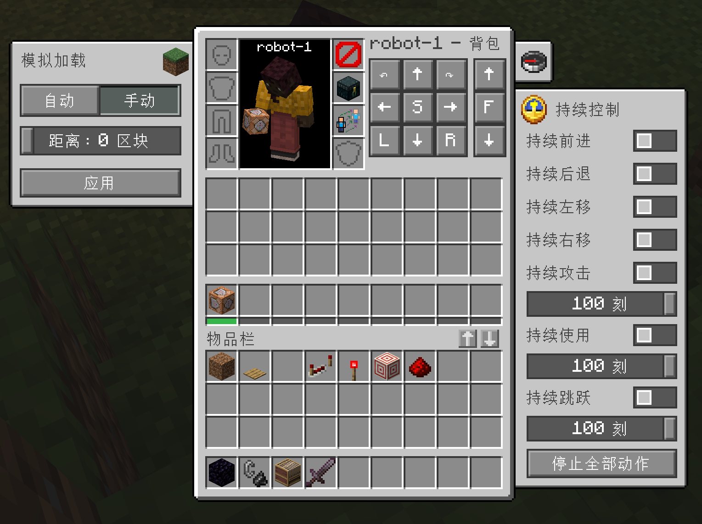
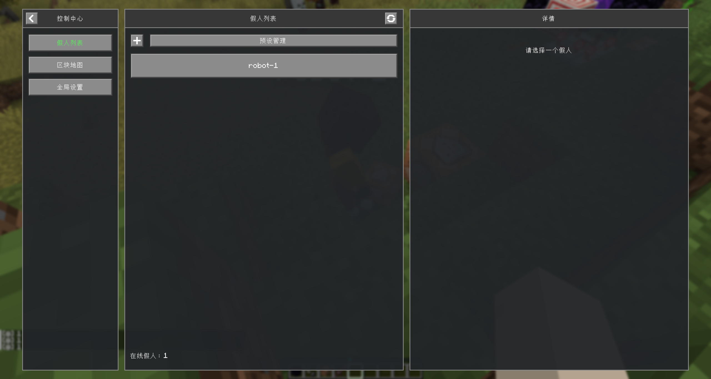
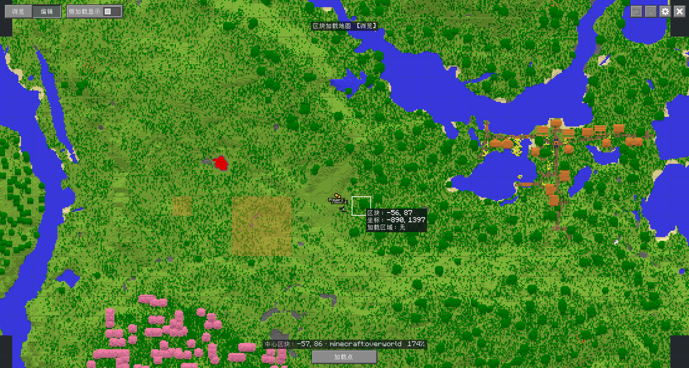

# ArchWeaver

[English](./docs/all_readme/README_EN.md) | 简体中文

适用于 Minecraft 26.1.2 / NeoForge 的辅助模组，目前提供假玩家管理、区块加载和客户端相机功能，支持假人/玩偶生成、背包管理、姿态控制等。


## 开发原因

Neoforge 高版本没有类似 Carpet 的假人 mod，还有做生电机器时，保持区块加载很麻烦，因此就有了这个模组。
之后打算顺下去扩展，比如让假人接入AI，添加类似建筑之杖等世界编辑功能，
因此模组名使用 ArchWeaver（上层编织者？/架构编织者？）。主要是听起来很有逼格，而且可以联想到 Architect（建筑师）。

## 两个模组

本项目发布两个独立的包：

| 包                               | 模组 ID               | 内容                                                   | 依赖              |
| -------------------------------- | --------------------- | ------------------------------------------------------ | ----------------- |
| **ArchWeaver**                   | `archweaver`          | 假人、区块加载等纯功能，**不注册任何方块、物品、实体** | 无                |
| **ArchWeaver: Artifice（造物）** | `archweaver_artifice` | 一些实用方块、物品、实体等                             | 必须装 ArchWeaver |

> 分开发布是为了：**ArchWeaver 可以随时装上或卸载，不会损坏存档**。
> 需要注册的内容也因此只在 Artifice 里。两个包版本号独立，Artifice 对核心的依赖范围写得较宽，

## 简介

- 默认按 `G` 打开控制中心，包括假人列表、区块地图、预设和分组管理等
- 默认按 `M` 打开区块加载地图
- 按 `F3+F5` 打开视角选择器，支持自由相机、正交视角等

## 图例





## 使用

### 假人功能

1. 模拟加载：自动/手动
2. 视角、朝向、移动、飞行、主手位置、持续动作控制、丢弃、骑乘等
3. 假人信息，包括游戏模式、名称、别名、坐标等
4. 假人背包、盔甲、副手、末影箱等
5. 假人附身功能（只改变物品栏和视角等，像是成就等不改变，因此不用“夺舍”）
6. 假人生命周期管理
7. 自动行为：（注：这些都是服务端功能，因此和Tweakeroo等客户端模组不同，也仅用于假人）

| 设置       | 说明                                                                   |
| ---------- | ---------------------------------------------------------------------- |
| 自动补货   | 手中可堆叠物品剩余不超过一组的 1/8 时，从 36 格主背包补到半组。        |
| 潜影盒补货 | 补货时也搜索主背包内的潜影盒；需同时开启普通补货。                     |
| 自动换工具 | 主手或副手工具剩余耐久不超过 10 时，换上背包中剩余耐久最高的同种物品。 |
| 自动钓鱼   | 原版浮漂咬钩后约 5 刻自动收杆，再等待 10 刻抛竿。                      |

### 玩偶功能

- 玩偶是原版 `minecraft:mannequin` 的扩展（不包含任何生物AI）。
- 玩偶默认作为装饰，含有装备栏、皮肤。
- 玩偶支持预设姿势和四肢 X/Y/Z 角度滑条。

### 区块加载功能

1. 支持在地图上进行选中区块进行强加载。
2. 支持管理每次加载的区块，并单独分组启用/禁用。

### 相机视角

1. 按住 `F3` 再按 `F5` 打开类似 `F3+F4` 的选择器。
2. 继续按 `F5` /鼠标点击切换类别。

支持原版第一人称、第三人称背面/正面（第二人称），以及灵魂出窍（自由相机）、正交（跟随玩家/独立相机）、肩后（左/右）、环绕、固定机位和跟随实体。

## 构建

```powershell
.\gradlew.bat build
```

生成的 JAR 会自动复制到根目录的 `build` 中并重命名为：

- `build/v<模组版本>/archweaver-v<模组版本>-mc<MC版本>-<加载器类型>.jar`
- `build/v<模组版本>/archweaver_artifice-v<内容版版本>-mc<MC版本>-<加载器类型>.jar`

运行开发客户端：

```powershell
# 同时加载核心与内容版（日常开发用这个）
.\gradlew.bat :artifice:neoforge:runClient

# 只加载核心
.\gradlew.bat :neoforge:runClient
```

在 Windows 上，也可以运行 `tools\1.一键启动mc脚本.ps1`。

## 详细说明

### 命令

命令参考请看 [命令说明](./docs/命令说明.md)。

## 配置文件

首次加载后会自动生成服务端和客户端配置文件。配置文件中的布尔值使用 `true`/`false`（不要加双引号）。

### 服务端配置

文件位置：`<世界目录>/serverconfig/archweaver-server.toml`
单人游戏位置：`config/archweaver-server.toml`

```toml
[commands]
# 使用 /fakeplayer 和 /player 的最低原版权限等级，范围 0~4。
permissionLevel = 2

[profiles]
# 缓存和在线档案均不可用时，是否允许使用离线 UUID。
allowOfflineProfiles = true
# 玩家档案解析策略：
#   ONLINE_PREFERRED 优先复用可信正版缓存，否则从 Mojang 获取档案；身份查询失败时根据配置决定是否回退。
#   CACHE_ONLY       不发起在线查询，只使用服务器缓存；未命中时根据 allowOfflineProfiles 决定是否回退。
#   OFFLINE_ONLY     始终按名称生成稳定的离线 UUID。
strategy = "ONLINE_PREFERRED"

[persistence]
# 新假人的游戏重启恢复默认值；每个假人也可在背包页面左侧设置栏单独调整。
restoreFakePlayers = true

[chunkloading]
# 单个区块加载点允许的最大半径，范围 0~32；0 表示仅中心区块。
maxRadius = 8
# 所有启用手动区域允许强加载的区块总数，范围 1~65536。
maxForcedChunks = 2048
# 所有手动强加载点允许完整模拟的区块总数，范围 1~16384。
maxTickingChunks = 512
# 所有在线自定义模式假人去重后的模拟区块预算，范围 -1~65536；-1 表示不限。
maxPlayerLoadingChunks = 65536

[ui]
# 普通容器是否显示物品转移按钮；假人物品栏始终显示。
enableContainerTransferButtons = false
# 假人别名是否在 Tab 中优先显示，并在头顶名牌与假人列表中排在真实名称上方。
fakePlayerAliasFirst = false
# 别名为空的假人是否用「假人」占位，作用于头顶名牌与假人列表。
fakePlayerEmptyAliasMarker = true
```

`robot-1` 这类本地名称会直接使用离线档案。

### 客户端配置

文件位置：`config/archweaver-client.toml`

```toml
[chunkMap]
# 地图玩家和假人名称的显示缩放，范围 0.5~2.0。
markerNameScale = 1.0
# 是否显示强加载区域外围由票据传播出的弱加载范围。
showWeakLoading = true

[mainPage]
# 控制中心上次停留的页面：0 假人列表，1 区块地图，2 全局设置。
lastView = 0

[camera]
# 自由相机的移动速度，单位格/刻，范围 0.02~8；按住疾跑键时为三倍。
speed = 0.5
# 正交视角的显示高度，单位格，范围 2~256。
scale = 32
# 视角的偏航角，范围 -180~180。
yaw = 45
# 视角的俯仰角，范围 -90~90。
pitch = 35.2643897
# 环绕相机与跟随实体的距离，单位格，范围 1~128。
distance = 8
# 肩后视角的相机距离，单位格，范围 1~12。
shoulder_distance = 4
# 肩后视角相对身体的横向偏移，单位格，范围 0~3。
shoulder_offset = 0.7
# 自动环绕的旋转速度，单位度/秒，范围 -180~180；负数反向。
orbit_speed = 12
# 仅对独立观察模式生效：是否允许从身体位置攻击、放置和使用，距离受原版触及范围限制。
body_interaction = false
# 仅对独立观察模式生效：开启后鼠标与移动键控制身体，关闭后控制相机；身体始终受服务器物理与伤害影响。
body_movement = false
# 环绕视角下是否按 orbit_speed 自动旋转。
auto_orbit = false
# F3+F5 打开选择器时是否预选上一个视角（包含子视角）；历史仅保留在当前会话中。
select_previous = true
# 是否将 Tweakeroo 灵魂出窍作为外部相机进行互斥控制；需要安装 Tweakeroo 才会生效。
tweakerooExclusivity = true
# 暂停 ArchWeaver 相机；不会修改外部相机状态，解除后需要重新选择视角。
pause_archweaver = false
```

### 持久化数据

假人的数据分散保存在以下位置：

| 数据                       | 保存位置                                                            | 说明                                                                                                 |
| -------------------------- | ------------------------------------------------------------------- | ---------------------------------------------------------------------------------------------------- |
| 身份（UUID 与名称）        | `data/archweaver/fake_players.dat`                                  | 驻留清单，用于服务器重启后按身份恢复假人。                                                           |
| 重启恢复开关               | `data/archweaver/fake_players.dat`                                  | 每个假人单独保存；配置文件中的全局开关作为新假人的默认值。                                           |
| 自动化设置（四项开关）     | `data/archweaver/fake_players.dat`                                  | 随驻留记录和预设一起保存，重启后恢复。                                                               |
| 持续动作、移动输入、潜行等 | 预设内快照                                                          | 随预设保存；驻留恢复不携带，启动后由操作者重新设置。                                                 |
| 背包、位置、能力、经验等   | `playerdata/<UUID>.dat`                                             | 由原版玩家数据负责保存和恢复。                                                                       |
| 手动加载区域与假人加载策略 | `data/archweaver/chunk_loaders.dat`（备份在 `archweaver/backups/`） | 保存区域 UUID、名称、维度、非矩形区块集合，以及假人 UUID、启用状态和模拟距离；活动票据在启动后重建。 |

## 其他
