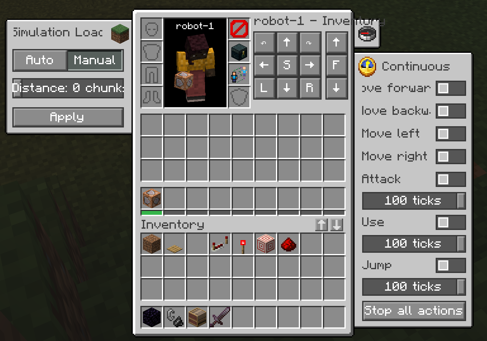
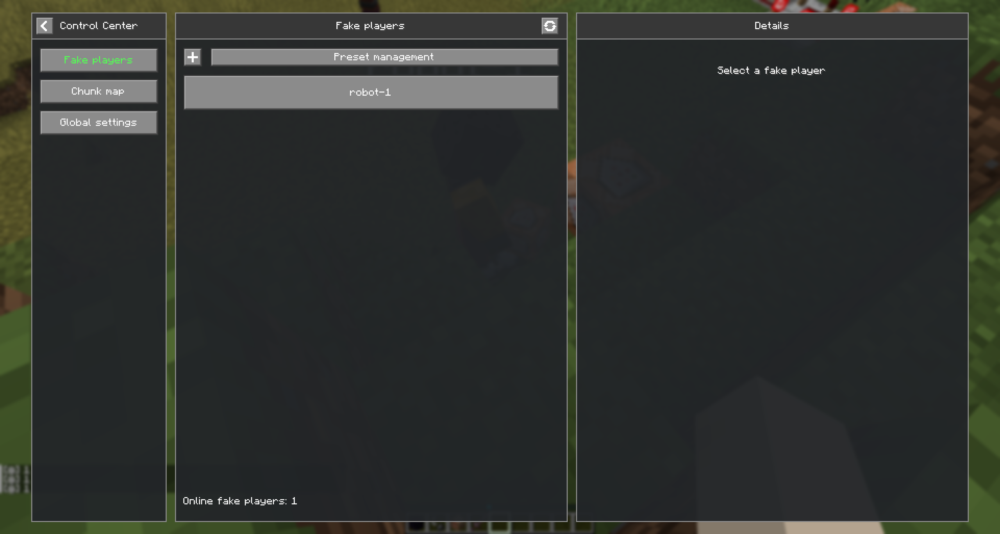
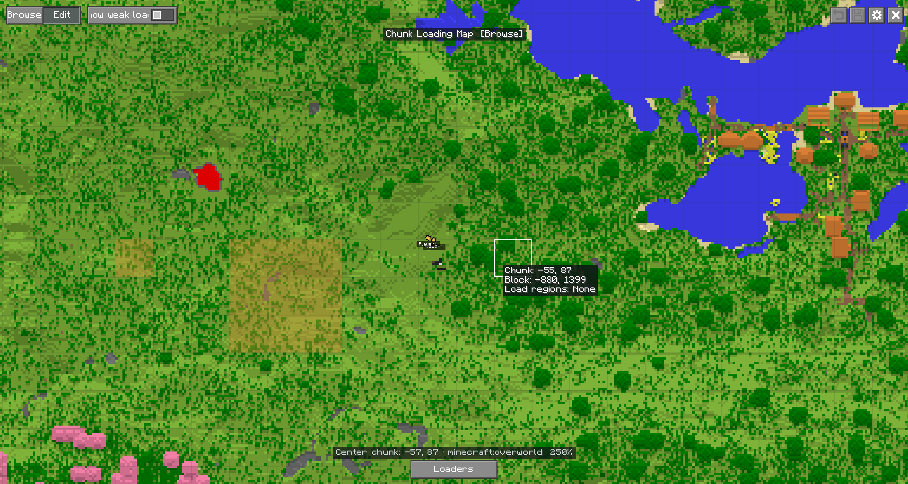

# ArchWeaver

English | [简体中文](../../README.md)

A utility mod for Minecraft 26.1.2 / NeoForge, currently featuring fake player management, chunk loading, and client-side camera perspectives. It supports spawning fake players and mannequins, inventory management, pose control, and more.


## Motivation

Recent NeoForge versions lack a Carpet-like fake player mod, and keeping chunks loaded while building technical Minecraft contraptions can be inconvenient. ArchWeaver was created to address these needs.

Future ideas include connecting fake players to AI and adding world editing tools such as a building wand. The name ArchWeaver suggests weaving architecture and brings "Architect" to mind.

## Two Mods

This project produces two separate JARs:

| Mod                      | Mod ID                | Scope                                                                                             | Dependency          |
| ------------------------ | --------------------- | ------------------------------------------------------------------------------------------------- | ------------------- |
| **ArchWeaver**           | `archweaver`          | Fake players, chunk loading, and other utility features. Registers no blocks, items, or entities. | None                |
| **ArchWeaver: Artifice** | `archweaver_artifice` | Some utility blocks, items, entities, etc.                                                        | Requires ArchWeaver |

> ArchWeaver can be installed or removed without leaving registered content in a world save. Content that requires registry entries belongs in Artifice. The two mods have independent version numbers; Artifice declares a compatible range of ArchWeaver versions.

## Overview

- Press `G` by default to open the control center, including the fake player list, chunk map, presets, and groups.
- Press `M` by default to open the chunk loading map.
- Press `F3+F5` to open the perspective selector, which supports free camera and orthographic views.

## Screenshots





## Usage

### Fake Players

1. Simulation loading: automatic and manual modes.
2. View direction, rotation, movement, flight, hotbar selection, continuous actions, item dropping, and riding.
3. Fake player information, including game mode, name, alias, and coordinates.
4. Inventory, armor, offhand, and ender chest management.
5. Possession: take control of a fake player's inventory and viewpoint. This does not transfer everything, such as advancements.
6. Lifecycle management.
7. Automation: these features run on the server and apply only to fake players, unlike client mods such as Tweakeroo.

| Setting               | Behavior                                                                                                                                                |
| --------------------- | ------------------------------------------------------------------------------------------------------------------------------------------------------- |
| Auto replenishment    | When a stackable item in hand has at most one eighth of a stack remaining, refill it to half a stack from the 36-slot main inventory.                   |
| Shulker replenishment | Also search shulker boxes in the main inventory when replenishing. Requires ordinary replenishment to be enabled.                                       |
| Auto tool replacement | When a tool in either hand has at most 10 durability remaining, replace it with the same item type with the most remaining durability in the inventory. |
| Auto fishing          | Reel in about 5 ticks after a vanilla fishing bobber gets a bite, then wait 10 ticks before casting again.                                              |

### Mannequins

- Mannequins extend the vanilla `minecraft:mannequin`.
- A mannequin is decorative by default; it has equipment slots and a skin.
- Mannequins support preset poses and per-limb X/Y/Z angle sliders.

### Chunk Loading

1. Select chunks on the map to force-load them.
2. Manage loading regions and enable or disable them individually.

### Camera Perspectives

1. Hold `F3` and press `F5` to open a selector similar to `F3+F4`.
2. Press `F5` again, or click with the mouse, to switch categories.

Supported views include vanilla first person, third person back and front (second person), as well as free camera, orthographic (follow player or independent camera), shoulder (left and right), orbit, fixed camera, and follow entity.

## Building

```powershell
.\gradlew.bat build
```

The built JARs are automatically copied into the root `build` directory and renamed to:

- `build/v<mod-version>/archweaver-v<mod-version>-mc<minecraft-version>-<loader>.jar`
- `build/v<mod-version>/archweaver_artifice-v<artifice-version>-mc<minecraft-version>-<loader>.jar`

Run the development client with both mods, or with ArchWeaver alone:

```powershell
.\gradlew.bat :artifice:neoforge:runClient

.\gradlew.bat :neoforge:runClient
```

On Windows, you can also run [`tools/1.一键启动mc脚本.ps1`](../../tools/1.一键启动mc脚本.ps1).

## Reference

### Commands

See the separate [command reference](../commands_en.md).

## Configuration

Server and client configuration files are generated automatically on first load. Boolean values must use `true` or `false` without quotation marks.

### Server Configuration

File: `<world-directory>/serverconfig/archweaver-server.toml`

Single-player location: `config/archweaver-server.toml`

```toml
[commands]
# Minimum vanilla permission level for /fakeplayer and /player, from 0 to 4.
permissionLevel = 2

[profiles]
# Allow offline UUIDs when neither cached nor online profiles are available.
allowOfflineProfiles = true
# Profile resolution strategy:
#   ONLINE_PREFERRED Reuse trusted online-account cache entries first, otherwise fetch profiles from Mojang.
#                    If identity lookup fails, fallback depends on configuration.
#   CACHE_ONLY       Use only the server cache without online queries. Cache misses fall back according to allowOfflineProfiles.
#   OFFLINE_ONLY     Always generate a stable offline UUID from the name.
strategy = "ONLINE_PREFERRED"

[persistence]
# Default restart-restoration setting for newly spawned fake players; each fake player can override it in the inventory screen's left sidebar.
restoreFakePlayers = true

[chunkloading]
# Maximum radius for a single loading region, from 0 to 32; 0 means only the center chunk.
maxRadius = 8
# Total force-loaded chunk budget for all enabled manual regions, from 1 to 65536.
maxForcedChunks = 2048
# Total fully simulated chunk budget for all manual force-loading regions, from 1 to 16384.
maxTickingChunks = 512
# Deduplicated simulation chunk budget for all online fake players in custom mode, from -1 to 65536; -1 means unlimited.
maxPlayerLoadingChunks = 65536

[ui]
# Show item transfer buttons in ordinary containers. Fake player inventories always show them.
enableContainerTransferButtons = false
# Show fake player aliases first in the Tab list, and above the real name on name tags and in the fake player list.
fakePlayerAliasFirst = false
# Show the "Bot" placeholder for fake players with an empty alias, on name tags and in the fake player list.
fakePlayerEmptyAliasMarker = true
```

Local names such as `robot-1` use offline profiles directly.

### Client Configuration

File: `config/archweaver-client.toml`

```toml
[chunkMap]
# Display scale for player and fake player names on the map, from 0.5 to 2.0.
markerNameScale = 1.0
# Show the weakly loaded area around force-loaded regions caused by ticket propagation.
showWeakLoading = true
# Prefer the JourneyMap fullscreen map; fall back to the built-in map when unavailable.
journeyMap = false

[mainPage]
# Last page the control center stayed on: 0 fake player list, 1 chunk map, 2 global settings.
lastView = 0

[camera]
# Free camera movement speed in blocks per tick, from 0.02 to 8; tripled while sprinting.
speed = 0.5
# Orthographic display height in blocks, from 2 to 256.
scale = 32
# Camera yaw in degrees, from -180 to 180.
yaw = 45
# Camera pitch in degrees, from -90 to 90.
pitch = 35.2643897
# Orbit camera and follow-entity distance in blocks, from 1 to 128.
distance = 8
# Shoulder camera distance in blocks, from 1 to 12.
shoulder_distance = 4
# Shoulder camera lateral offset from the body in blocks, from 0 to 3.
shoulder_offset = 0.7
# Auto orbit speed in degrees per second, from -180 to 180; negative reverses direction.
orbit_speed = 12
# Detached observation modes only: allow attacking, placing and using from the body position, with vanilla reach limits.
body_interaction = false
# Detached observation modes only: on, mouse and movement keys control the body; off, they control the camera. The body is still affected by server physics and damage.
body_movement = false
# Whether the orbit view rotates automatically at orbit_speed.
auto_orbit = false
# Preselect the previous view (including its submode) when opening F3+F5; history is kept only for the current session.
select_previous = true
# Whether to manage Tweakeroo free camera as an exclusive external camera; requires Tweakeroo to be installed.
tweakerooExclusivity = true
# Pause ArchWeaver cameras without changing external camera state; select a view again after resuming.
pause_archweaver = false
```

### Persistent Data

Fake player and chunk loading data is stored in the following locations, relative to the world directory:

| Data                                                    | Location                                                               | Description                                                                                                                                                               |
| ------------------------------------------------------- | ---------------------------------------------------------------------- | ------------------------------------------------------------------------------------------------------------------------------------------------------------------------- |
| Identity (UUID and name)                                | `data/archweaver/fake_players.dat`                                     | Resident list used to restore fake players by identity after a server restart.                                                                                            |
| Restart-respawn switch                                  | `data/archweaver/fake_players.dat`                                     | Saved per fake player; the global setting in the config file is the default for newly spawned fake players.                                                               |
| Automation settings (four toggles)                      | `data/archweaver/fake_players.dat`                                     | Saved with resident records and presets, and restored after restart.                                                                                                      |
| Continuous actions, movement input, sneaking, etc.      | Preset snapshots                                                       | Saved with presets. Resident restoration does not carry these settings; operators must set them again after startup.                                                      |
| Inventory, position, abilities, experience, etc.        | `playerdata/<UUID>.dat`                                                | Saved and restored by vanilla player data handling.                                                                                                                       |
| Manual loading regions and fake player loading policies | `data/archweaver/chunk_loaders.dat` (backups in `archweaver/backups/`) | Saves region UUIDs, names, dimensions, non-rectangular chunk sets, fake player UUIDs, enabled states, and simulation distances. Active tickets are rebuilt after startup. |
